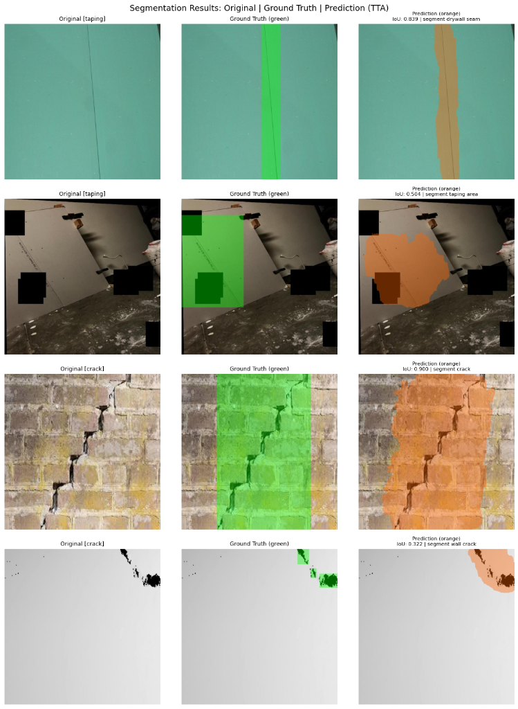
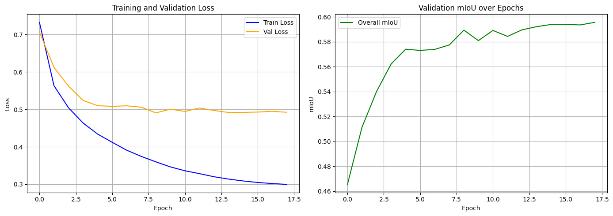
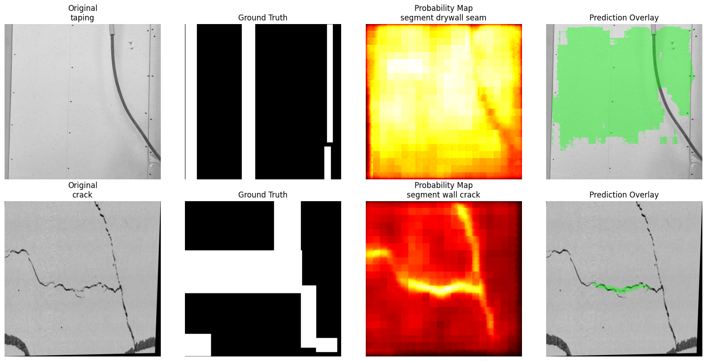

# Prompted Segmentation for Drywall QA

A text-conditioned segmentation system that produces binary masks for drywall defects given a natural-language prompt. Fine-tuned **CLIPSeg** on two construction QA datasets to segment **taping areas** and **wall cracks**.

---

## Goal

Given an image and a text prompt (e.g., `"segment crack"`, `"segment taping area"`), produce a pixel-level binary mask highlighting the target defect region.

### Supported Prompts

| Dataset | Prompts |
|---------|---------|
| Taping Area (Dataset 1) | `segment taping area`, `segment joint tape`, `segment drywall seam` |
| Cracks (Dataset 2) | `segment crack`, `segment wall crack` |

---

## Approach

### Model: CLIPSeg (CIDAS/clipseg-rd64-refined)

- **Architecture**: CLIP vision-language backbone + lightweight decoder for dense prediction
- **Why CLIPSeg?**: Native text-conditioning allows zero-shot generalization; fine-tuning adapts it to domain-specific drywall imagery
- **Training Strategy**: End-to-end fine-tuning with combined BCE + Dice loss
- **Test-Time Augmentation (TTA)**: Horizontal flip, vertical flip, and 90° rotation — predictions averaged for robustness
- **Threshold Tuning**: Optimal threshold of **0.35** selected via grid search over validation set
- **Reproducibility**: All random seeds set to `42` (`torch.manual_seed`, `np.random.seed`, `random.seed`)

### Pipeline

```
Input Image + Text Prompt
        |
        v
   CLIPSeg Encoder (CLIP ViT-B/16)
        |
        v
   Dense Decoder (upsampling + projection)
        |
        v
   Sigmoid -> Threshold (0.35)
        |
        v
   Binary Mask (PNG, {0, 255})
```

---

## Datasets

| | Dataset 1: Taping Area | Dataset 2: Cracks |
|---|---|---|
| **Source** | [Roboflow: drywall-join-detect](https://universe.roboflow.com/objectdetect-pu6rn/drywall-join-detect) | [Roboflow: cracks-3ii36](https://universe.roboflow.com/fyp-ny1jt/cracks-3ii36) |
| **Task** | Taping / joint area segmentation | Wall crack segmentation |
| **Samples** | 1,186 prompt-image pairs | 5,329 prompt-image pairs |
| **Format** | COCO to binary masks | COCO to binary masks |

**Total**: 6,515 prompt-image-mask triplets

### Data Split

| Split | Taping | Crack | Total |
|-------|--------|-------|-------|
| Train | 936 | 5,125 | 6,061 |
| Val | 250 | 200 | 450 |
| **Total** | **1,186** | **5,325** | **6,515** |

> Stratified by dataset source. Validation split used for threshold tuning and final evaluation.

---

## Results

### Visual Results

<p align="center">
  
</p>

### Final Metrics (Validation Set, with TTA + Threshold 0.35)

| Category | mIoU | Dice |
|----------|------|------|
| **Crack** | 0.6364 | 0.7588 |
| **Taping** | 0.6120 | 0.7466 |
| **Overall** | **0.6242** | **0.7527** |

### Consistency Across Prompt Variations

| Category | Consistency Score |
|----------|-----------------|
| Crack | 0.8932 |
| Taping | 0.8162 |
| **Overall** | **0.8547** |

> Consistency = mean IoU between masks predicted by different prompt synonyms for the same image. Score of 1.0 means perfectly identical predictions regardless of prompt phrasing.

### Training Curves

<p align="center">
  
</p>

### Zero-Shot vs Fine-Tuned

<p align="center">
  
</p>

---

## Runtime and Footprint

| Metric | Value |
|--------|-------|
| GPU | Tesla T4 (Google Colab) |
| Training Time | ~1.45 hours (20 epochs) |
| Best Epoch | 18 |
| Batch Size | 8 |
| Image Size | 352 x 352 |
| Avg Inference Time | 21.6 ms/image |
| Model Parameters | 150.7M |
| Checkpoint Size | 583.9 MB |

---

## Limitations & Failure Cases

- **Hairline cracks**: Very thin cracks (< 2px wide) are sometimes missed — CLIPSeg's 352×352 input resolution limits fine detail
- **Low-contrast taping**: Taping areas on similarly-colored drywall can be under-segmented
- **Overlapping annotations**: Some Roboflow images have noisy ground truth from COCO polygon conversion, affecting metrics
- **Class imbalance**: Crack dataset (5,125 train) significantly outnumbers taping (936 train), which may bias overall learning

---

## Repository Structure

```
drywall-prompted-seg/
|-- main.ipynb                  # Full pipeline: data prep, training, evaluation, prediction
|-- README.md                   # This file
|-- master_dataset.csv          # Complete dataset manifest with splits
|-- data/
|   +-- splits/
|       +-- master_dataset.csv  # image_id, image_path, mask_path, prompt, dataset, split
|-- models/
|   +-- checkpoints/
|       +-- best_model.pt       # Fine-tuned CLIPSeg checkpoint
|-- predictions/                # All prediction masks (PNG, {0, 255})
|   |-- 0__segment_taping_area.png
|   |-- 0__segment_joint_tape.png
|   |-- 0__segment_drywall_seam.png
|   |-- 250__segment_crack.png
|   |-- 250__segment_wall_crack.png
|   +-- ...                     # 1,150 total prediction masks
|-- figures/                    # Visualizations for README/report
|   |-- visual_results.png
|   |-- training_curves.png
|   |-- zero_shot_results.png
|   |-- sample_predictions.png
|   +-- sample_verification.png
```

---

## Quick Start

### Prerequisites
> **Important**: The fine-tuned model checkpoint is managed by Git LFS due to its size (584 MB). Ensure you have [Git LFS](https://git-lfs.github.com/) installed before cloning.

```bash
# Clone the repository and pull the large model weights
git lfs install
git clone <repository_url>
git lfs pull

# Install dependencies
pip install -r requirements.txt
```

### Inference
```python
from transformers import CLIPSegProcessor, CLIPSegForImageSegmentation
from PIL import Image
import torch, cv2, numpy as np

# Load model
processor = CLIPSegProcessor.from_pretrained("CIDAS/clipseg-rd64-refined")
model = CLIPSegForImageSegmentation.from_pretrained("CIDAS/clipseg-rd64-refined")
checkpoint = torch.load("models/checkpoints/best_model.pt", map_location="cpu")
model.load_state_dict(checkpoint['model_state_dict'])
model.eval()

# Run inference
image = Image.open("your_image.jpg").convert("RGB")
prompt = "segment crack"
inputs = processor(text=[prompt], images=[image], return_tensors="pt", padding=True)
with torch.no_grad():
    logits = model(**inputs).logits[0]
    mask = (torch.sigmoid(logits).numpy() > 0.35).astype(np.uint8) * 255
cv2.imwrite("output_mask.png", cv2.resize(mask, image.size[::-1]))
```

---

## Prediction Mask Format

- **Format**: PNG, single-channel
- **Spatial size**: Same as source image
- **Values**: `{0, 255}` (binary)
- **Naming**: `{image_id}__{prompt_with_underscores}.png`
  - Example: `123__segment_crack.png`, `0__segment_taping_area.png`
